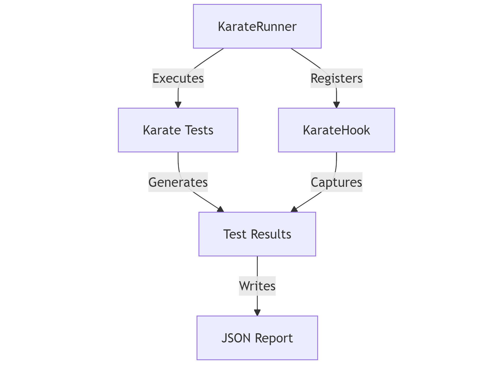

# Karate Template Project

## Overview
This is a Karate template project with a custom `KarateRunTimeHook` implementation. The `KarateHook` class is used to capture test results such as test name, status, and timestamp for all Karate tests and generate custom metadata reports in JSON format. This template provides an easy way to run tests with consistent reporting across all scenarios.

## Why Use the `KarateHook` Class?
The `KarateHook` class is introduced to simplify the process of handling test metadata and generating custom reports. Instead of writing JavaScript hooks inside each feature file, which can become repetitive and error-prone, we centralize the logic in the `KarateHook` class. This approach ensures all test results are captured in one place, allowing for easier report generation and maintainability.

### What the `KarateHook` Does:
- Tracks test execution (start and end).
- Collects results like test name, status (pass/fail),  timestamp and more..
- Writes the aggregated test data into a JSON file at the end of the test suite.

## The `KarateRunner` Class
The `KarateRunner` class is responsible for executing the Karate tests and registering the `KarateHook` to capture test metadata. It sets up the test environment, specifies the test path, and ensures that all tests are executed in parallel.
`If you are using IntelliJ , Simply right click on KarateRunner.java and select run tests`
### How It Works:
1. **Test Path and Tags**: The runner identifies the test files to execute from the specified path (`classpath:com/app/tests`) and excludes tests tagged with `@ignore`.
2. **Registering the Hook**: The `KarateHook` is attached to capture and manage test results as the tests run.
3. **Parallel Execution**: Tests are executed in parallel (you can specify the number of threads), and results are validated after completion.
4. **Assertion**: After running the tests, it asserts that all tests passed and displays any error messages if they didn’t.

This setup ensures that custom reporting is managed in a single place, making it more efficient than using JavaScript hooks spread across multiple feature files.

## Custom Reporting Approach
This template is designed to generate custom reporting metadata for Karate tests. This approach is preferable to writing hooks in JavaScript for every feature file because:
- **Centralized**: All reporting logic is in one place (Java).
- **Less Repetition**: No need to repeatedly write JavaScript hooks in each feature file.
- **Customizable**: Easy to modify and extend reporting logic.

## Mermaid Diagram: Runner and Hook Connection



## Sample JSON result produced by test runner

```json
[
  {
    "name": "get all users and then get the first user by id",
    "status": "Passed",
    "timestamp": "2024-10-02T20:24:36.214765200"
  },
  {
    "name": "create a user and then get it by id",
    "status": "Passed",
    "timestamp": "2024-10-02T20:24:36.942745100"
  }
]
```
